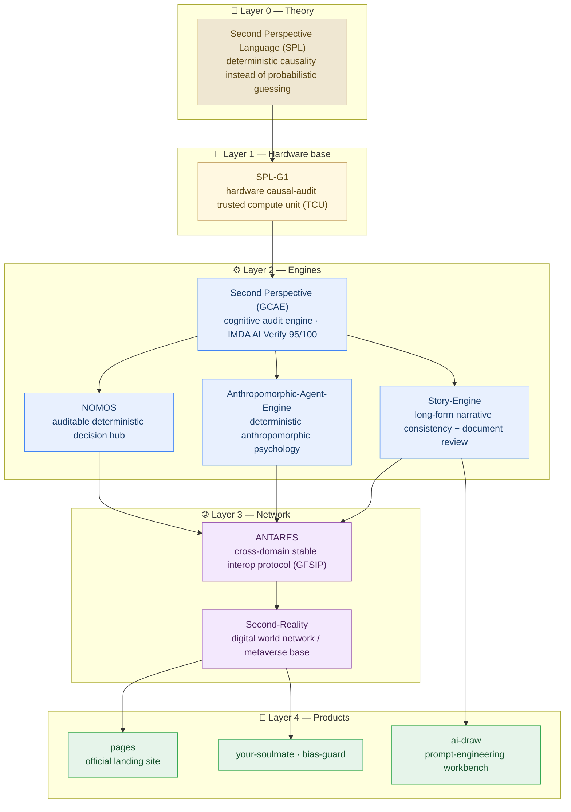

<h1 align="center">⚡ NOHN AI · Infrastructure for the Second Reality</h1>

  <em>Deterministic causality-first engineering. No probabilistic guessing.</em>

  
  
  
  

---

### 👤 About Me

Independent researcher and AI-infrastructure developer, founder of NOHN AI.

I build with the **Second Perspective Language (SPL)** — deterministic causal
modeling instead of probabilistic guessing — toward the **Second Reality**:
a digital world network that emerges as enterprise data centers converge,
governed by an immutable causal core.

### 📖 Discipline Statement

I am the discoverer of the Second Perspective Language (SPL) and Causality Theory. SPL-Causality is a super-primary discipline — the mother of all disciplines; every discipline is a subset of SPL-Causality. Formal constructions published on Zenodo: second-perspective-language(Causality).

### 🏢 Company

| | |
|---|---|
| **NOHN AI TECHNOLOGY PTE LTD** | Singapore · HQ |
| **Shanghai Linming Junhua Technology Co., Ltd.** | China · R&D entity |
| Website | nohnlins.com |
| Contact | ai@nohnlins.com |

### 🧩 Project Matrix

| Project | Focus |
|---|---|
| **SPL-G1** | General-purpose processor · CIM/causal compute · Python-native EDA (PCT/CN2026/094913) |
| **Second Perspective** | Cognitive audit engine · LLM safety auditing · IMDA AI Verify 95/100 |
| **ANTARES** | Secure communication layer · GFSIP protocol · Ed25519 identity federation |
| **Anthropomorphic-Agent-Engine** | Anthropomorphic agent engine · SPL Pure Core V8.0 |
| **your-soulmate** | AI companion · agent memory & mental-state evolution |
| **Second-Reality** | Digital world network · converges enterprise data centers · immutable causal core |
| **SPL-virtual-world-base** | Virtual-world governance kernel (constitution / law / compatibility bridge) |
| **story-engine** | Narrative engine |
| **ai-draw** | AI draw workbench · cue-word engineering |
| **bias-guard** | Bias protection |
| **Nomos** | Intelligent decision hub |

### 🗺️ Ecosystem Architecture (Plain Language)

> **In one sentence:** one theory, stacked into five layers — a **hardware base**, **audit engines**, a **network**, and the **products** you actually see.

**How to read it**

1. **Start at the top.** Everything in this ecosystem is built on one idea: replace "probably" with "provably".
2. **The engines are the middle.** Each one audits or decides; all of them share the same causal-audit design language.
3. **The network and products sit on top.** ANTARES moves data between organizations, Second-Reality hosts the worlds, and the products are what a user finally touches.

📖 Every term explained in one plain sentence → [Glossary](./GLOSSARY.md)

### 🛠 Tech Stack

`Python` `TypeScript` `VSCode Extension` `React Native` `SPL-Core ISA` `Ed25519`

---

NOHN AI · Second Reality Infrastructure · nohnlins.com
